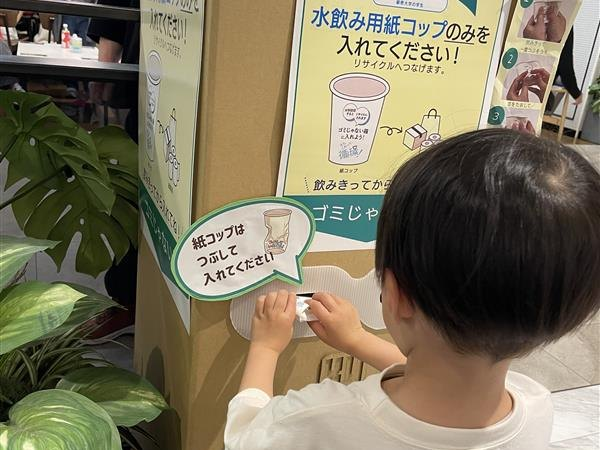
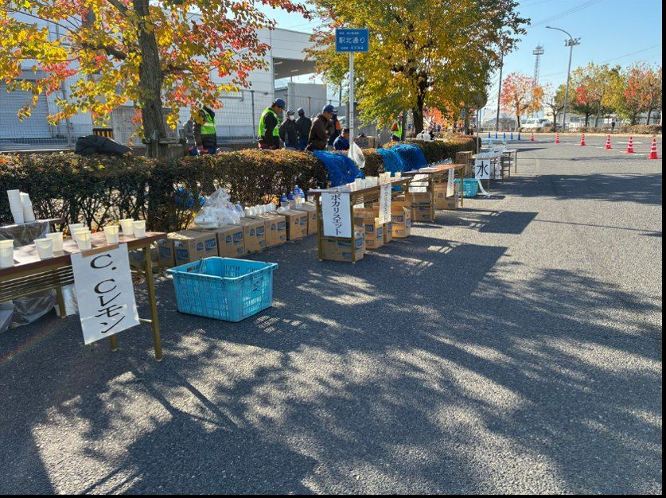

<!--
━━━━━━━━━━━━━━━━━━━━━━━━━━━━━━━━━━━━━━━━━━━━━━━━━━━━━
 活動レポート・お知らせの追加・編集のしかた（このファイルを書き換えるだけ）
━━━━━━━━━━━━━━━━━━━━━━━━━━━━━━━━━━━━━━━━━━━━━━━━━━━━━
 ● 新しい記事を足すとき
    下にある1件ぶん（「===」から次の「===」の手前まで）をコピーして、
    このコメントのすぐ下に貼り付け、中身を書き換えてください。
    ※ 上にあるものほど、サイトの一覧で上に表示されます。

 ● 1件に必ず書くこと（本文の前の3行）
    id    : 半角の英数字とハイフンだけ。他と重複しない名前（URLに使われます）
    date  : 日付（例 2026-08-01）
    title : 一覧に表示される見出し

 ● 必要なときだけ足す行（省略できます）
    until   : これから開催されるものに書く終了日（例 2026-08-28）
              この日までトップページの「開催予定」枠に大きく表示されます。
              過ぎると自動で枠から外れ、普通の記事として一覧に残ります。
    project : 紙コップの取り組みなら pccp と書く
              「PCCP」バッジが付き、PCCPサイトにも表示されます。

 ● そのあと1行あけて、本文を書きます
    本文では次が使えます：
      画像   →  
      リンク →  [表示する文字](リンク先のURL)
      太字   →  **強調したい文字**
      見出し →  ### 小見出し
━━━━━━━━━━━━━━━━━━━━━━━━━━━━━━━━━━━━━━━━━━━━━━━━━━━━━
-->

===
id: seminar-2026-08
date: 2026-07-31
until: 2026-08-28
title: 8月セミナー「生分解性プラスチックの基礎から資源循環まで」を開催します

資源循環に関する知見を深めることを目的として、8月にセミナーを開催いたします。大学生の皆さま、当法人の法人会員の皆さまを主な対象としていますが、初めての開催のため、本テーマにご関心をお持ちの企業・団体の皆さまのご参加も歓迎いたします。

### 開催概要

**日時** 2026年8月28日（金）16:00〜18:00

**会場** 叡啓大学 1階プロジェクトワークスペース（PWS）／ 広島市中区幟町1-5

**参加費** 無料

### プログラム

**16:00〜17:00 セミナー**
演題「生分解性プラスチックの基礎から資源循環まで」
講師：小林 哲也 氏（共和化工株式会社 開発事業本部 開発広報部 次長）

**17:00〜18:00 交流会**（自由参加）

### 講師プロフィール

小林 哲也（こばやし てつや）氏

2003年に三菱化学株式会社（現 三菱ケミカル）に入社以来、化学・素材分野の研究開発および事業に長年携わる。2015年からは生分解性プラスチックの事業開発を担当し、米国赴任も含めてグローバルな視点から研究と市場開拓に取り組む。2025年には共和化工株式会社に入社するとともに、一般財団法人 Green Sports Alliance の評議員に就任し、環境負荷低減と持続可能な社会の実現を目指した活動に幅広く従事。

### お申し込み

**2026年8月11日（火）まで**に、下記のフォームよりお申し込みください。

[お申し込みフォームへ](https://forms.gle/DpxZ9vQiugFSvaRh9)

ご不明な点は [お問い合わせ](index.html#contact) からお気軽にご連絡ください。

===
id: outlets-pilot
date: 2026-03-28
project: pccp
title: THE OUTLETS HIROSHIMAで紙コップ回収・再資源化の実証実験を開始

一般社団法人サーキュラー・ラボ・広島は、THE OUTLETS HIROSHIMAのフードコートにおいて、水飲み用使い捨て紙コップの回収・再資源化に向けた実証実験を2026年3月28日より実施しています。専用回収BOXの設置と運用を通じて、現場で無理なく続けられる資源循環の仕組みづくりを目指しています。

### 実証実験の背景

商業施設のフードコートでは、日常的に多くの使い捨て紙コップが使用されています。一方で、飲み残しや異物混入、分別にかかる手間などの課題があり、資源として活かしきれず焼却処分されることも少なくありません。

紙コップは素材として資源化の可能性を持つ一方、現場では飲み残しへの対応や異物混入の防止、分別作業の負担といった「見えないコスト」が、循環を進めにくくする要因となってきました。

### 取り組みのポイント

本プロジェクトは、サーキュラー・ラボ・広島と共に活動する叡啓大学の学生による提案をきっかけに始まりました。利用者の動線を踏まえ、捨てやすく、かつ混入物を防ぎやすい回収BOXの配置や運用方法を検討し、現場での実装につなげています。

また、趣旨に賛同する企業からの協賛により、専用紙コップの制作・購入費など、運用に必要なコストの一部を支えています。これにより、小規模な資源回収の仕組みが現実的に成り立つかを検証しています。

今回の実証実験では、紙コップの回収率や異物混入の状況、運用負担、コストバランスなどを確認しながら、継続可能な資源循環モデルの構築を目指しています。

### 実施概要

**開始日** 2026年3月28日（実施期間：約3か月間）

**会場** THE OUTLETS HIROSHIMA フードコート

**実施内容** 水飲み用使い捨て紙コップの専用回収BOX設置、および回収した紙コップの再資源化ルートの構築

### 参画団体・協力企業

**主催** 一般社団法人サーキュラー・ラボ・広島

**実施協力** THE OUTLETS HIROSHIMA、叡啓大学

**協賛** 株式会社桐原容器工業所、株式会社広島経済研究所、株式会社シンギ

**回収・資源循環協力** 株式会社不二ビルサービス、広島きれい株式会社、有限会社丸久商店

### 今後に向けて

本実験を通じて得られたデータや現場での知見をもとに、継続可能な資源循環モデルの構築を目指します。また、使い捨て容器の資源循環を社会に実装していくための仕組みを整理し、将来的には他の商業施設や公共空間などへの展開も視野に入れています。

===
id: bay-marathon
date: 2025-11-30
project: pccp
title: 広島ベイマラソン大会で紙コップ回収活動を実施

11月30日に開催された「第34回広島ベイマラソン大会」にて、給水所で使用された紙コップの回収活動を行いました。当日は給水所の近くで、捨てられたごみを紙コップと他のごみに分ける作業を行いました。

### 活動の目的

マラソン大会では、多くのランナーが給水を利用するため、短時間で大量の紙コップが使われます。

私たちは「少しでもごみを減らすことができないか」「正しく分別・回収することで環境への負担を減らせないか」と考え、今回の活動を実施しました。

### 活動の様子と成果

ランナーの方々が捨てる紙コップを集めることで、周囲に散らばるごみを減らすことにもつながりました。

実際に活動してみると、想像以上の数の紙コップが短時間で集まり、イベントにおける使い捨て紙コップの多さを実感しました。**48kgもの紙コップを回収**することができました。

### 地域との連携とリサイクル

活動中には、「ありがとう」「お疲れさま」と声をかけてくださる方もおり、環境のための行動が大会運営の支えにもなっていることを感じることができました。本活動の実施にあたり、ご協力いただいた坂町の皆様、ありがとうございました。

回収した紙コップは、コアレックス信栄株式会社様にお送りし、トイレットペーパー・ティッシュペーパーにリサイクルしていただきました。

### 今後に向けて

今回の活動を通して、イベントで発生するごみの問題は身近なものであり、少しの工夫や行動で改善できる部分があることを学びました。

今後もPCCPの活動として、地域のイベントなどと連携しながら、環境に配慮した取り組みを続けていきたいと考えています。
